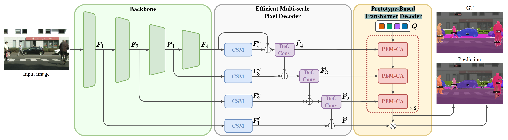

# fai-pem-m-ade

## Overview
The models is a [PEM](https://github.com/NiccoloCavagnero/PEM) model otimized by [FocoosAI](https://focoos.ai) for the [ADE20K dataset](https://groups.csail.mit.edu/vision/datasets/ADE20K/). It is a semantic segmentation model able to segment 150 classes, comprising both stuff (sky, road, etc.) and thing (dog, cat, car, etc.).


## Benchmark

Note: FPS are computed on NVIDIA T4 using TensorRT and image size 640x640.

## Model Details
The model is based on the [PEM](https://github.com/NiccoloCavagnero/PEM) architecture. It is a segmentation model that uses a transformer-based encoder-decoder architecture.
Similarly to [Mask2Former](https://arxiv.org/abs/2112.01527), PEM uses a mask-classification approach, where the prediction is made by a set of segmentation mask with associated class probabilities. 

### Neural Network Architecture
The [PEM](https://arxiv.org/abs/2112.01527) FocoosAI implementation is the original neural network architecture, fully described in this [paper](https://arxiv.org/abs/2112.01527).

PEM is a hybrid model that uses three main components: a *backbone* for extracting features, an *Efficient Multi-scale Pixel Decoder* for upscaling the features, and a *Prototype-Based
Transformer Decoder* for generating the segmentation output.



In this implementation:

- the backbone is [STDC-2](https://github.com/MichaelFan01/STDC-Seg) that show an amazing trade-off between performance and efficiency.
- the Efficient Multi-scale pixel decoder is a fully convolutional [FPN](https://arxiv.org/abs/1612.03144) getting the features from the stage 2 (1/4 resolution), 3 (1/8 resolution), 4 (1/16 resolution) and 5 (1/32 resolution) of the backbone. For the sake of portability, we avoided using deformable convolution in the pixel decoder and instead used standard convolution, which only marginally affects the accuracy.
- The Prototype-Based transformer decoder has 3 decoder layers (instead of 9) and 100 learnable queries.

### Losses
We use the same losses as the original paper:

- loss_ce: Cross-entropy loss for the classification of the classes
- loss_dice: Dice loss for the segmentation of the classes
- loss_mask: A binary cross-entropy loss applied to the predicted segmentation masks

These losses are applied to each output of the transformer decoder, meaning that we apply it on the output and on each auxiliary output of the 3 transformer decoder layers.
Please refer to the [PEM paper](https://arxiv.org/abs/2402.19422) for more details.

### Output Format
The pre-processed output of the model is set of masks with associated class probabilities. In particular, the output is composed by three tensors:

- class_ids: a tensor of 100 elements containing the class id associated with each mask (such as 1 for wall, 2 for building, etc.)
- scores: a tensor of 100 elements containing the corresponding probability of the class_id
- masks: a tensor of shape (100, H, W) where H and W are the height and width of the input image and the values represent the index of the class_id associated with the pixel

The model does not need NMS (non-maximum suppression) because the output is already a set of masks with associated class probabilities and has been trained to avoid overlapping masks.

After the post-processing, the output is a [Focoos Detections](https://github.com/FocoosAI/focoos/blob/4a317a269cb7758ea71b255faeba654d21182083/focoos/ports.py#L179) object containing the predicted masks with confidence greather than a specific threshold (0.5 by default).


## Classes
The model is pretrained on the [ADE20K dataset](https://groups.csail.mit.edu/vision/datasets/ADE20K/) with 150 classes.

<div class="class-table" markdown>
  <style>
    .class-table {
      max-height: 500px;
      overflow-y: auto;
      /* border: 1px solid #ccc; */
      /* border-radius: 4px; */
      padding: 1rem;
      margin: 1rem 0;
      background: rgba(0,0,0,0.05);
      width: 95%;
      margin-left: auto;
      margin-right: auto;
    }
    .class-table table {
      width: 100%;
    }
    .class-table thead {
      position: sticky;
      top: 0;
      background: #2b2b2b;
      z-index: 1;
    }
  </style>
<table>
  <thead>
    <tr style="text-align: right;">
      <th></th>
      <th>Class</th>
      <th>mIoU</th>
    </tr>
  </thead>
  <tbody>
    <tr>
      <td>1</td>
      <td>wall</td>
      <td>74.337503</td>
    </tr>
    <tr>
      <td>2</td>
      <td>building</td>
      <td>79.119750</td>
    </tr>
    <tr>
      <td>3</td>
      <td>sky</td>
      <td>94.028561</td>
    </tr>
    <tr>
      <td>4</td>
      <td>floor</td>
      <td>80.319745</td>
    </tr>
    <tr>
      <td>5</td>
      <td>tree</td>
      <td>72.642485</td>
    </tr>
    <tr>
      <td>6</td>
      <td>ceiling</td>
      <td>81.279892</td>
    </tr>
    <tr>
      <td>7</td>
      <td>road, route</td>
      <td>81.648870</td>
    </tr>
    <tr>
      <td>8</td>
      <td>bed</td>
      <td>87.067133</td>
    </tr>
    <tr>
      <td>9</td>
      <td>window</td>
      <td>57.692944</td>
    </tr>
    <tr>
      <td>10</td>
      <td>grass</td>
      <td>64.037461</td>
    </tr>
    <tr>
      <td>11</td>
      <td>cabinet</td>
      <td>55.727047</td>
    </tr>
    <tr>
      <td>12</td>
      <td>sidewalk, pavement</td>
      <td>67.037500</td>
    </tr>
    <tr>
      <td>13</td>
      <td>person</td>
      <td>77.387992</td>
    </tr>
    <tr>
      <td>14</td>
      <td>earth, ground</td>
      <td>30.498023</td>
    </tr>
    <tr>
      <td>15</td>
      <td>door</td>
      <td>39.182182</td>
    </tr>
    <tr>
      <td>16</td>
      <td>table</td>
      <td>53.401437</td>
    </tr>
    <tr>
      <td>17</td>
      <td>mountain, mount</td>
      <td>58.531859</td>
    </tr>
    <tr>
      <td>18</td>
      <td>plant</td>
      <td>51.253109</td>
    </tr>
    <tr>
      <td>19</td>
      <td>curtain</td>
      <td>68.199827</td>
    </tr>
    <tr>
      <td>20</td>
      <td>chair</td>
      <td>53.497120</td>
    </tr>
    <tr>
      <td>21</td>
      <td>car</td>
      <td>81.680999</td>
    </tr>
    <tr>
      <td>22</td>
      <td>water</td>
      <td>53.344319</td>
    </tr>
    <tr>
      <td>23</td>
      <td>painting, picture</td>
      <td>62.213626</td>
    </tr>
    <tr>
      <td>24</td>
      <td>sofa</td>
      <td>60.401488</td>
    </tr>
    <tr>
      <td>25</td>
      <td>shelf</td>
      <td>37.551746</td>
    </tr>
    <tr>
      <td>26</td>
      <td>house</td>
      <td>36.653860</td>
    </tr>
    <tr>
      <td>27</td>
      <td>sea</td>
      <td>55.440400</td>
    </tr>
    <tr>
      <td>28</td>
      <td>mirror</td>
      <td>54.726385</td>
    </tr>
    <tr>
      <td>29</td>
      <td>rug</td>
      <td>56.101766</td>
    </tr>
    <tr>
      <td>30</td>
      <td>field</td>
      <td>32.746485</td>
    </tr>
    <tr>
      <td>31</td>
      <td>armchair</td>
      <td>41.634605</td>
    </tr>
    <tr>
      <td>32</td>
      <td>seat</td>
      <td>48.010567</td>
    </tr>
    <tr>
      <td>33</td>
      <td>fence</td>
      <td>39.673824</td>
    </tr>
    <tr>
      <td>34</td>
      <td>desk</td>
      <td>38.415899</td>
    </tr>
    <tr>
      <td>35</td>
      <td>rock, stone</td>
      <td>50.697798</td>
    </tr>
    <tr>
      <td>36</td>
      <td>wardrobe, closet, press</td>
      <td>52.420475</td>
    </tr>
    <tr>
      <td>37</td>
      <td>lamp</td>
      <td>62.700654</td>
    </tr>
    <tr>
      <td>38</td>
      <td>tub</td>
      <td>55.264523</td>
    </tr>
    <tr>
      <td>39</td>
      <td>rail</td>
      <td>30.203166</td>
    </tr>
    <tr>
      <td>40</td>
      <td>cushion</td>
      <td>48.499915</td>
    </tr>
    <tr>
      <td>41</td>
      <td>base, pedestal, stand</td>
      <td>21.699030</td>
    </tr>
    <tr>
      <td>42</td>
      <td>box</td>
      <td>16.803223</td>
    </tr>
    <tr>
      <td>43</td>
      <td>column, pillar</td>
      <td>40.488309</td>
    </tr>
    <tr>
      <td>44</td>
      <td>signboard, sign</td>
      <td>33.655059</td>
    </tr>
    <tr>
      <td>45</td>
      <td>chest of drawers, chest, bureau, dresser</td>
      <td>33.176764</td>
    </tr>
    <tr>
      <td>46</td>
      <td>counter</td>
      <td>25.841054</td>
    </tr>
    <tr>
      <td>47</td>
      <td>sand</td>
      <td>33.232262</td>
    </tr>
    <tr>
      <td>48</td>
      <td>sink</td>
      <td>62.348760</td>
    </tr>
    <tr>
      <td>49</td>
      <td>skyscraper</td>
      <td>57.038075</td>
    </tr>
    <tr>
      <td>50</td>
      <td>fireplace</td>
      <td>58.237755</td>
    </tr>
    <tr>
      <td>51</td>
      <td>refrigerator, icebox</td>
      <td>61.291011</td>
    </tr>
    <tr>
      <td>52</td>
      <td>grandstand, covered stand</td>
      <td>39.165150</td>
    </tr>
    <tr>
      <td>53</td>
      <td>path</td>
      <td>23.160695</td>
    </tr>
    <tr>
      <td>54</td>
      <td>stairs</td>
      <td>22.309399</td>
    </tr>
    <tr>
      <td>55</td>
      <td>runway</td>
      <td>60.580131</td>
    </tr>
    <tr>
      <td>56</td>
      <td>case, display case, showcase, vitrine</td>
      <td>48.408872</td>
    </tr>
    <tr>
      <td>57</td>
      <td>pool table, billiard table, snooker table</td>
      <td>84.872249</td>
    </tr>
    <tr>
      <td>58</td>
      <td>pillow</td>
      <td>53.224956</td>
    </tr>
    <tr>
      <td>59</td>
      <td>screen door, screen</td>
      <td>56.276838</td>
    </tr>
    <tr>
      <td>60</td>
      <td>stairway, staircase</td>
      <td>36.104900</td>
    </tr>
    <tr>
      <td>61</td>
      <td>river</td>
      <td>13.602169</td>
    </tr>
    <tr>
      <td>62</td>
      <td>bridge, span</td>
      <td>26.708709</td>
    </tr>
    <tr>
      <td>63</td>
      <td>bookcase</td>
      <td>21.877108</td>
    </tr>
    <tr>
      <td>64</td>
      <td>blind, screen</td>
      <td>38.901936</td>
    </tr>
    <tr>
      <td>65</td>
      <td>coffee table</td>
      <td>57.190511</td>
    </tr>
    <tr>
      <td>66</td>
      <td>toilet, can, commode, crapper, pot, potty, stool, throne</td>
      <td>78.551851</td>
    </tr>
    <tr>
      <td>67</td>
      <td>flower</td>
      <td>36.034432</td>
    </tr>
    <tr>
      <td>68</td>
      <td>book</td>
      <td>43.935487</td>
    </tr>
    <tr>
      <td>69</td>
      <td>hill</td>
      <td>3.691260</td>
    </tr>
    <tr>
      <td>70</td>
      <td>bench</td>
      <td>38.161890</td>
    </tr>
    <tr>
      <td>71</td>
      <td>countertop</td>
      <td>48.774731</td>
    </tr>
    <tr>
      <td>72</td>
      <td>stove</td>
      <td>59.137866</td>
    </tr>
    <tr>
      <td>73</td>
      <td>palm, palm tree</td>
      <td>47.085360</td>
    </tr>
    <tr>
      <td>74</td>
      <td>kitchen island</td>
      <td>29.551124</td>
    </tr>
    <tr>
      <td>75</td>
      <td>computer</td>
      <td>54.107913</td>
    </tr>
    <tr>
      <td>76</td>
      <td>swivel chair</td>
      <td>30.262003</td>
    </tr>
    <tr>
      <td>77</td>
      <td>boat</td>
      <td>29.459543</td>
    </tr>
    <tr>
      <td>78</td>
      <td>bar</td>
      <td>23.483096</td>
    </tr>
    <tr>
      <td>79</td>
      <td>arcade machine</td>
      <td>31.765568</td>
    </tr>
    <tr>
      <td>80</td>
      <td>hovel, hut, hutch, shack, shanty</td>
      <td>28.238492</td>
    </tr>
    <tr>
      <td>81</td>
      <td>bus</td>
      <td>77.739971</td>
    </tr>
    <tr>
      <td>82</td>
      <td>towel</td>
      <td>46.452029</td>
    </tr>
    <tr>
      <td>83</td>
      <td>light</td>
      <td>55.789100</td>
    </tr>
    <tr>
      <td>84</td>
      <td>truck</td>
      <td>31.239669</td>
    </tr>
    <tr>
      <td>85</td>
      <td>tower</td>
      <td>5.711885</td>
    </tr>
    <tr>
      <td>86</td>
      <td>chandelier</td>
      <td>68.016502</td>
    </tr>
    <tr>
      <td>87</td>
      <td>awning, sunshade, sunblind</td>
      <td>20.505302</td>
    </tr>
    <tr>
      <td>88</td>
      <td>street lamp</td>
      <td>24.564635</td>
    </tr>
    <tr>
      <td>89</td>
      <td>booth</td>
      <td>47.862268</td>
    </tr>
    <tr>
      <td>90</td>
      <td>tv</td>
      <td>62.551762</td>
    </tr>
    <tr>
      <td>91</td>
      <td>plane</td>
      <td>38.489103</td>
    </tr>
    <tr>
      <td>92</td>
      <td>dirt track</td>
      <td>0.000000</td>
    </tr>
    <tr>
      <td>93</td>
      <td>clothes</td>
      <td>20.012554</td>
    </tr>
    <tr>
      <td>94</td>
      <td>pole</td>
      <td>23.950313</td>
    </tr>
    <tr>
      <td>95</td>
      <td>land, ground, soil</td>
      <td>5.656714</td>
    </tr>
    <tr>
      <td>96</td>
      <td>bannister, banister, balustrade, balusters, handrail</td>
      <td>8.381384</td>
    </tr>
    <tr>
      <td>97</td>
      <td>escalator, moving staircase, moving stairway</td>
      <td>15.821733</td>
    </tr>
    <tr>
      <td>98</td>
      <td>ottoman, pouf, pouffe, puff, hassock</td>
      <td>37.542588</td>
    </tr>
    <tr>
      <td>99</td>
      <td>bottle</td>
      <td>19.822251</td>
    </tr>
    <tr>
      <td>100</td>
      <td>buffet, counter, sideboard</td>
      <td>51.652114</td>
    </tr>
    <tr>
      <td>101</td>
      <td>poster, posting, placard, notice, bill, card</td>
      <td>29.924542</td>
    </tr>
    <tr>
      <td>102</td>
      <td>stage</td>
      <td>9.609455</td>
    </tr>
    <tr>
      <td>103</td>
      <td>van</td>
      <td>47.025967</td>
    </tr>
    <tr>
      <td>104</td>
      <td>ship</td>
      <td>55.074084</td>
    </tr>
    <tr>
      <td>105</td>
      <td>fountain</td>
      <td>17.290110</td>
    </tr>
    <tr>
      <td>106</td>
      <td>conveyer belt, conveyor belt, conveyer, conveyor, transporter</td>
      <td>61.823266</td>
    </tr>
    <tr>
      <td>107</td>
      <td>canopy</td>
      <td>26.648268</td>
    </tr>
    <tr>
      <td>108</td>
      <td>washer, automatic washer, washing machine</td>
      <td>64.310497</td>
    </tr>
    <tr>
      <td>109</td>
      <td>plaything, toy</td>
      <td>19.928945</td>
    </tr>
    <tr>
      <td>110</td>
      <td>pool</td>
      <td>33.422917</td>
    </tr>
    <tr>
      <td>111</td>
      <td>stool</td>
      <td>38.180305</td>
    </tr>
    <tr>
      <td>112</td>
      <td>barrel, cask</td>
      <td>17.123817</td>
    </tr>
    <tr>
      <td>113</td>
      <td>basket, handbasket</td>
      <td>24.963656</td>
    </tr>
    <tr>
      <td>114</td>
      <td>falls</td>
      <td>78.158461</td>
    </tr>
    <tr>
      <td>115</td>
      <td>tent</td>
      <td>93.326707</td>
    </tr>
    <tr>
      <td>116</td>
      <td>bag</td>
      <td>9.387806</td>
    </tr>
    <tr>
      <td>117</td>
      <td>minibike, motorbike</td>
      <td>57.763263</td>
    </tr>
    <tr>
      <td>118</td>
      <td>cradle</td>
      <td>72.828743</td>
    </tr>
    <tr>
      <td>119</td>
      <td>oven</td>
      <td>28.594460</td>
    </tr>
    <tr>
      <td>120</td>
      <td>ball</td>
      <td>26.076361</td>
    </tr>
    <tr>
      <td>121</td>
      <td>food, solid food</td>
      <td>56.607175</td>
    </tr>
    <tr>
      <td>122</td>
      <td>step, stair</td>
      <td>21.334000</td>
    </tr>
    <tr>
      <td>123</td>
      <td>tank, storage tank</td>
      <td>43.550723</td>
    </tr>
    <tr>
      <td>124</td>
      <td>trade name</td>
      <td>22.527263</td>
    </tr>
    <tr>
      <td>125</td>
      <td>microwave</td>
      <td>38.382788</td>
    </tr>
    <tr>
      <td>126</td>
      <td>pot</td>
      <td>39.025281</td>
    </tr>
    <tr>
      <td>127</td>
      <td>animal</td>
      <td>62.038062</td>
    </tr>
    <tr>
      <td>128</td>
      <td>bicycle</td>
      <td>50.424046</td>
    </tr>
    <tr>
      <td>129</td>
      <td>lake</td>
      <td>0.001222</td>
    </tr>
    <tr>
      <td>130</td>
      <td>dishwasher</td>
      <td>61.042789</td>
    </tr>
    <tr>
      <td>131</td>
      <td>screen</td>
      <td>52.390601</td>
    </tr>
    <tr>
      <td>132</td>
      <td>blanket, cover</td>
      <td>19.766706</td>
    </tr>
    <tr>
      <td>133</td>
      <td>sculpture</td>
      <td>7.937280</td>
    </tr>
    <tr>
      <td>134</td>
      <td>hood, exhaust hood</td>
      <td>54.671838</td>
    </tr>
    <tr>
      <td>135</td>
      <td>sconce</td>
      <td>41.374571</td>
    </tr>
    <tr>
      <td>136</td>
      <td>vase</td>
      <td>33.791622</td>
    </tr>
    <tr>
      <td>137</td>
      <td>traffic light</td>
      <td>29.473643</td>
    </tr>
    <tr>
      <td>138</td>
      <td>tray</td>
      <td>7.665119</td>
    </tr>
    <tr>
      <td>139</td>
      <td>trash can</td>
      <td>27.949197</td>
    </tr>
    <tr>
      <td>140</td>
      <td>fan</td>
      <td>52.897089</td>
    </tr>
    <tr>
      <td>141</td>
      <td>pier</td>
      <td>11.480271</td>
    </tr>
    <tr>
      <td>142</td>
      <td>crt screen</td>
      <td>0.871237</td>
    </tr>
    <tr>
      <td>143</td>
      <td>plate</td>
      <td>34.651471</td>
    </tr>
    <tr>
      <td>144</td>
      <td>monitor</td>
      <td>5.974933</td>
    </tr>
    <tr>
      <td>145</td>
      <td>bulletin board</td>
      <td>35.343538</td>
    </tr>
    <tr>
      <td>146</td>
      <td>shower</td>
      <td>9.502449</td>
    </tr>
    <tr>
      <td>147</td>
      <td>radiator</td>
      <td>38.686717</td>
    </tr>
    <tr>
      <td>148</td>
      <td>glass, drinking glass</td>
      <td>13.974199</td>
    </tr>
    <tr>
      <td>149</td>
      <td>clock</td>
      <td>21.836098</td>
    </tr>
    <tr>
      <td>150</td>
      <td>flag</td>
      <td>24.892008</td>
    </tr>
  </tbody>
</table>

</div>


## What are you waiting? Try it!
```python
from focoos import Focoos
import os

# Initialize the Focoos client with your API key
focoos = Focoos(api_key=os.getenv("FOCOOS_API_KEY"))

# Get the remote model (fai-pem-m-ade) from Focoos API
model = focoos.get_remote_model("fai-pem-m-ade")

# Run inference on an image
predictions = model.infer("./image.jpg", threshold=0.5)

# Output the predictions
print(predictions)
```
