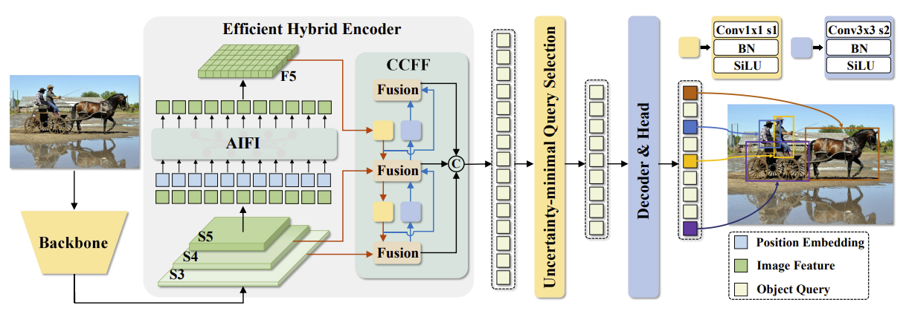

# FAI-DETR (FocoosAI Detection Transformer)

## Overview

FAI-DETR is an advanced object detection model based on the [RT-DETR](https://arxiv.org/abs/2304.08069) (Detection Transformer) architecture, optimized by FocoosAI for efficient and accurate object detection tasks. This model eliminates the need for hand-crafted components like non-maximum suppression (NMS) and anchor generation by using a transformer-based approach with learnable object queries.

The model employs a set-based global loss through bipartite matching and a transformer encoder-decoder architecture that directly predicts bounding boxes and class labels. This end-to-end approach simplifies the detection pipeline while achieving competitive performance.

## Neural Network Architecture



The FAI-DETR architecture consists of four main components:

### Backbone
- **Purpose**: Feature extraction from input images
- **Design**: Configurable backbone network (ResNet, STDC, etc.)
- **Output**: Multi-scale features at different resolutions
- **Integration**: Features are processed through the encoder for global context

### Encoder
- **Architecture**: Transformer encoder with multi-scale deformable attention
- **Components**:
  - Multi-scale deformable self-attention layers
  - Position embeddings (sine-based)
  - Feed-forward networks (FFN)
  - CSPRep layers for efficient feature processing
- **Features**: Processes multi-scale features to capture global context
- **Layers**: Configurable number of encoder layers (default: 1)

### Decoder
- **Architecture**: Multi-scale deformable transformer decoder
- **Components**:
  - Self-attention layers for query interaction
  - Cross-attention layers with deformable attention
  - Feed-forward networks
  - Reference point refinement
- **Queries**: 300 learnable object queries (configurable)
- **Layers**: Configurable number of decoder layers (default: 6)

### Detection Head
- **Classification Head**: Predicts class probabilities for each query
- **Regression Head**: Predicts bounding box coordinates (center, width, height)
- **Output Format**: Direct box predictions without anchors or post-processing

## Configuration Parameters

### Core Model Parameters
- `num_classes` (int): Number of object detection classes
- `num_queries` (int, default=300): Number of learnable object queries
- `backbone_config` (BackboneConfig): Backbone network configuration

### Encoder Configuration
- `pixel_decoder_out_dim` (int, default=256): Encoder output dimension
- `pixel_decoder_feat_dim` (int, default=256): Encoder feature dimension
- `pixel_decoder_num_encoder_layers` (int, default=1): Number of encoder layers
- `pixel_decoder_expansion` (float, default=1.0): Channel expansion ratio
- `pixel_decoder_dim_feedforward` (int, default=1024): FFN dimension
- `pixel_decoder_dropout` (float, default=0.0): Dropout rate
- `pixel_decoder_nhead` (int, default=8): Number of attention heads

### Decoder Configuration
- `transformer_predictor_hidden_dim` (int, default=256): Decoder hidden dimension
- `transformer_predictor_dec_layers` (int, default=6): Number of decoder layers
- `transformer_predictor_dim_feedforward` (int, default=1024): FFN dimension
- `transformer_predictor_nhead` (int, default=8): Number of attention heads
- `transformer_predictor_out_dim` (int, default=256): Decoder output dimension
- `head_out_dim` (int, default=256): Detection head output dimension

### Inference Configuration
- `threshold` (float, default=0.5): Confidence threshold for detections
- `top_k` (int, default=300): Maximum number of detections to return

## Supported Tasks

### Object Detection
- **Output**: Bounding boxes with class labels and confidence scores
- **Use Cases**:
  - General object detection in natural images
  - Autonomous driving (vehicle, pedestrian detection)
  - Surveillance and security applications
  - Industrial quality control
  - Medical image analysis
- **Performance**: End-to-end detection without NMS post-processing

## Model Outputs

### Internal Output (`DETRModelOutput`)
- `boxes` (torch.Tensor): Shape [B, num_queries, 4] - Bounding boxes in XYXY format normalized to [0, 1]
- `logits` (torch.Tensor): Shape [B, num_queries, num_classes] - Class predictions
- `loss` (Optional[dict]): Training losses including:
    - `loss_vfl`: Varifocal loss for classification
    - `loss_bbox`: L1 loss for bounding box regression
    - `loss_giou`: Generalized IoU loss for box alignment

### Inference Output (`FocoosDetections`)
For each detected object:

- `bbox` (List[float]): Bounding box coordinates [x1, y1, x2, y2]
- `conf` (float): Confidence score
- `cls_id` (int): Class identifier
- `label` (Optional[str]): Human-readable class name

## Losses

The model employs three main loss components:

1. **Varifocal Loss (`loss_vfl`)**:
   - Advanced focal loss variant for classification
   - Handles foreground-background imbalance
   - Joint optimization of classification and localization quality

2. **Bounding Box Loss (`loss_bbox`)**:
   - L1 loss for direct coordinate regression
   - Normalized coordinates for scale invariance

3. **Generalized IoU Loss (`loss_giou`)**:
   - Shape-aware bounding box loss
   - Better gradient flow for overlapping boxes
   - Improved localization accuracy

## Available Models
Currently, you can find 3 fai-detr models on the Focoos Hub, 2 trained on COCO and one trained on Object365

| Model Name | Architecture | Domain (Classes) | Dataset | Metric | FPS Nvidia-T4 |
|------------|--------------|------------------|----------|---------|--------------|
| fai-detr-l-coco | [RT-DETR](https://github.com/lyuwenyu/RT-DETR) ([Resnet-50](https://github.com/pytorch/vision/blob/main/torchvision/models/resnet.py)) | Common Objects (80) | [COCO](https://cocodataset.org/#home) | bbox/AP: 53.06<br>bbox/AP50: 70.91 | 87 |
| fai-detr-m-coco | [RT-DETR](https://github.com/lyuwenyu/RT-DETR) ([STDC-2](https://github.com/MichaelFan01/STDC-Seg)) | Common Objects (80) | [COCO](https://cocodataset.org/#home) | bbox/AP: 44.69<br>bbox/AP50: 61.63 | 181 |
| fai-detr-l-obj365 | [RT-DETR](https://github.com/lyuwenyu/RT-DETR) ([Resnet50](https://github.com/pytorch/vision/blob/main/torchvision/models/resnet.py)) | Common Objects (365) | [Objects365](https://www.objects365.org/overview.html) | bbox/AP: 34.60<br>bbox/AP50: 45.81 | 87 |

## Example Usage

### Quick Start with Pre-trained Model

```python
from focoos import ASSETS_DIR, ModelManager
from PIL import Image

# Load a pre-trained model
model = ModelManager.get("fai-detr-m-coco")

# Run inference on an image
image = ASSETS_DIR / "federer.jpg"
result = model.infer(image,threshold=0.5, annotate=True)

# Process results
for detection in result.detections:
    print(f"Class: {detection.label}, Confidence: {detection.conf:.3f}")

# Visualize image
Image.fromarray(result.image)
```

### Custom Model Configuration

```python
from focoos.models.fai_detr.config import DETRConfig
from focoos.models.fai_detr.modelling import FAIDetr
from focoos.nn.backbone.stdc import STDCConfig

# Configure the backbone
backbone_config = STDCConfig(
    model_type="stdc",
    use_pretrained=True,
)

# Configure the model
config = DETRConfig(
    backbone_config=backbone_config,
    num_classes=80,
    num_queries=300,
    transformer_predictor_dec_layers=3,
    threshold=0.5,
)

# Create the model
model = FAIDetr(config)
```
