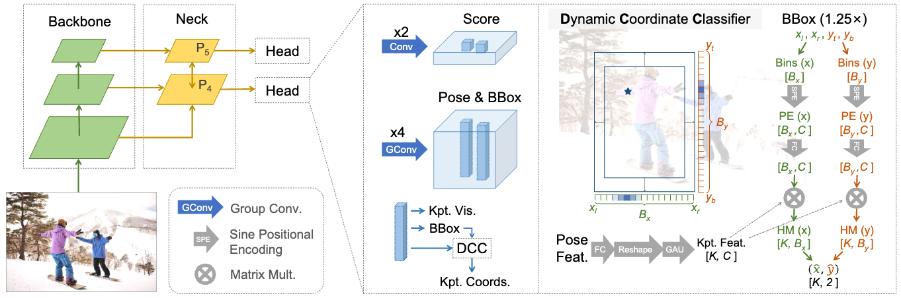

# RTMO

## Overview

[RTMO](https://arxiv.org/abs/2312.07526) (Real-Time Multi-person One-stage) is a high-performance, one-stage framework for real-time multi-person pose estimation. It integrates a novel coordinate classification method into YOLOXPose architecture, achieving an excellent balance between speed and accuracy.

The model avoids the typical slowdown of two-stage (top-down) methods in crowded scenes by directly predicting keypoints for all individuals in a single pass. Its core innovation is the **Dynamic Coordinate Classifier (DCC)**, which represents keypoints using dual 1-D heatmaps, enabling precise localization without the computational overhead of high-resolution feature maps.

## Neural Network Architecture


The RTMO architecture consists of three main components:

### Backbone
- **Purpose**: To extract multi-scale feature maps from the input image.
- **Design**: Configurable backbone network (e.g., ResNet, STDC), default is **CSPDarknet**.

### Neck
- **Purpose**: To fuse and refine the features from the backbone.
- **Design**: A **HybridEncoder** combines transformer encoder layers with CSP-based feature fusion, processing the last three feature maps from the backbone (with downsampling rates of 8, 16 and 32) to generate enhanced features for the head. The HybridEncoder consists of:
  - **Transformer Encoder**: Uses DETR-style transformer layers with sinusoidal positional encoding
  - **CSP (Cross Stage Partial) layers**: For efficient feature processing and fusion
  - **FPN (Feature Pyramid Network)**: Top-down and bottom-up feature fusion for multi-scale feature enhancement

### Head
- **Purpose**: To predict the final outputs for each grid cell on the feature map.
- **Components**:
  - **RTMOHeadModule**: Dual-branch architecture that processes shared input features:
    - **Classification Branch**: Processes half of input features through stacked convolutions to generate classification scores
    - **Pose Branch**: Processes the other half through group convolutions to generate pose features, bounding boxes, keypoint offsets, and visibility scores
  - **Dynamic Coordinate Classifier (DCC)**: This is the core component for keypoint localization. It takes the pose feature and translates it into K pairs of 1-D heatmaps (one for the horizontal axis, one for the vertical).

## Configuration Parameters

### Core Model parameters
- `num_classes` (int): Number of object classes (default=1 for "person" in COCO dataset).
- `num_keypoints` (int): Number of keypoints to predict (default=17 for person body).

### Backbone Configuration
- `backbone_config` (BackboneConfig): Backbone network configuration (default: `CSPConfig`)

### Neck
- `transformer_embed_dims` (int, default=256): Embedding dimension for transformer layers
- `transformer_num_heads` (int, default=8): Number of attention heads in transformer
- `transformer_feedforward_channels` (int, default=1024): Feedforward network dimension in transformer
- `transformer_dropout` (float, default=0.0): Dropout rate in transformer layers
- `transformer_encoder_layers` (int, default=1): Number of transformer encoder layers

### Head
- `in_channels` (int, default=256): Number of input channels to the head from the neck.
- `pose_vec_channels` (int, default=256): Dimension of the output pose feature vector for each grid, which is later fed into the DCC.
- `cls_feat_channels` (int, default=256): Number of channels in the classification branch
- `stacked_convs` (int, default=2): Number of stacked convolution layers in the classification and regression branches of the head.
- `featmap_strides` (List[int], default=[16, 8]): Strides of feature maps from backbone
- `featmap_strides_pointgenerator` (List[int], default=[16, 8]): Strides for point generator
- `centralize_points_pointgenerator` (bool, default=False): Whether to centralize points in point generator

#### Dynamic Coordinate Classifier (DCC)
- `feat_channels_dcc` (int, default=128): The feature dimension used within the DCC for keypoint feature representation.
- `num_bins` (Tuple[int, int], default=(192, 256)): The number of bins for the horizontal (x) and vertical (y) heatmaps, respectively.
- `spe_channels` (int, default=128): The channel dimension for the Sine Positional Encoding (SPE) used to encode bin coordinates.

#### GAU (Gated Attention Unit)
- `gau_s` (int, default=128): The self-attention feature dimension.
- `gau_expansion_factor` (int, default=2): The expansion factor for the hidden dimension in the GAU.
- `gau_dropout_rate` (float, default=0.0): Dropout rate applied within the GAU.

## Losses
1.  **Classification Loss (`loss_cls`)**: A **VariFocal Loss** is used to supervise the classification score of each grid.
2.  **Bounding Box Loss (`loss_bbox`)**: An **IoU (Intersection over Union) Loss** is applied to the decoded bounding boxes for positive grids.
3.  **MLE Loss (`loss_mle`)**: The core loss for keypoint localization. It is applied to the 1-D heatmaps from the DCC.
4.  **Keypoint Visibility Loss (`loss_vis`)**: A **Binary Cross-Entropy (BCE) Loss** is used to supervise the visibility prediction for each keypoint.
5. **OKS Loss (`loss_oks`)**: Auxiliary loss supervising keypoint regression with **OKS (Object Keypoint Similarity) Loss**. It uses DCC predictions as targets for further refinement.

The total loss is a weighted sum of these components.

## Supported Tasks

### Multi-Person Pose Estimation
- **Output**: Detects all individuals in an image, providing instance-level predictions. For each person, the model outputs a bounding box, a detection score, and the coordinates and visibility status for all keypoints.
- **Use Cases**: Action recognition, sports analytics, augmented reality, human-computer interaction.

## Model Outputs

### Internal Output (`RTMOModelOutput`)
- `outputs` (KeypointOutput):
    - `scores`: (torch.Tensor) Shape [B, num_detections] - Detection scores for each instance
    - `labels`: (torch.Tensor) Shape [B, num_detections] - Class labels for each instance
    - `pred_bboxes`: (torch.Tensor) Shape [B, num_detections, 4] - Predicted bounding boxes [x1, y1, x2, y2]
    - `bbox_scores`: (torch.Tensor) Shape [B, num_detections] - Scores for each bounding box
    - `pred_keypoints`: (torch.Tensor) Shape [B, num_detections, num_keypoints, 2] - Predicted keypoint coordinates
    - `keypoint_scores`: (torch.Tensor) Shape [B, num_detections, num_keypoints] - Scores for each keypoint
    - `keypoints_visible`: (torch.Tensor) Shape [B, num_detections, num_keypoints] - Visibility for keypoints
- `loss` (RTMOLoss): Training losses including:
    - `loss_bbox`: IoU loss for bounding box regression
    - `loss_vis`: Binary cross-entropy visibility loss
    - `loss_mle`: Maximum Likelihood Estimation (MLE) loss applied to 1-D keypoint heatmaps for keypoint localization
    - `loss_oks`: OKS (Object Keypoint Similarity) loss for better keypoint localization
    - `loss_cls`: VariFocal classification loss

### Inference Output (`FocoosDetections`)
For each detected object:

- `bbox` (List[float]): Bounding box coordinates [x1, y1, x2, y2]
- `conf` (float): Confidence score
- `cls_id` (int): Class identifier
- `label` (Optional[str]): Human-readable class name
- `keypoints` (List[List[int]]): Keypoints [x, y, visibility]


## Available Models

The following RTMO models are available on the Focoos Hub for multi-person pose estimation:

| Model Name      | Architecture                                                                 | Domain (Classes) | Dataset | Metric                                 | FPS Nvidia-T4 |
|-----------------|------------------------------------------------------------------------------|------------------|---------|----------------------------------------|---------------|
| rtmo-s-coco     | RTMO (CSP-Darknet) | Persons (1)      | COCO    | keypoints/AP: 67.94<br>keypoints/AP50: 87.86 | 104           |
| rtmo-m-coco     | RTMO (CSP-Darknet) | Persons (1)      | COCO    | keypoints/AP: 70.94<br>keypoints/AP50: 89.47 | 89            |
| rtmo-l-coco     | RTMO (CSP-Darknet) | Persons (1)      | COCO    | keypoints/AP: 72.14<br>keypoints/AP50: 89.85 | 63            |


## Example Usage

### Quick Start with Pre-trained Model

```python
from PIL import Image

from focoos.model_manager import ModelManager

# Load a pre-trained RTMO model
model = ModelManager.get("rtmo-s-coco")

# Run inference on an image
image = Image.open("path/to/image.jpg")
result = model.infer(image)

# Process results
for detection in result.detections:
    print(f"Class: {detection.label}, Confidence: {detection.conf:.3f}")
```

### Custom Model Configuration
```python
from focoos.models.rtmo.config import RTMOConfig
from focoos.models.rtmo.modelling import RTMO
from focoos.nn.backbone.csp_darknet import CSPConfig

# Configure the backbone
backbone_config = CSPConfig(
    size="small",
    use_pretrained=True,
)

# Configure the RTMO model
config = RTMOConfig(
    backbone_config=backbone_config,
    num_classes=1,  # COCO Person classes
    num_keypoints=17 # Number of keypoints for COCO Person body pose
)

# Create the model
model = RTMO(config)
```
